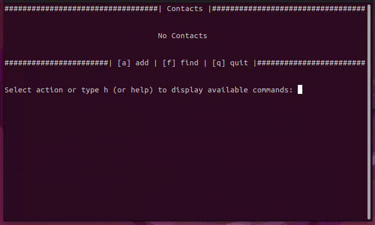

# Phonebook

**EN** | [RU](docs_ru/README.md)

## Description
Phonebook is a console application for contact management

## Features
* Create new contacts and save them in the database;
* Edit contact fields;
* Delete contacts;
* Find contacts by string query. The search is performed by all fields of contacts. If there are several matches, the whole list of contacts matching the query is displayed;
* The list of contacts is displayed by pages. By default, 6 contacts are displayed per page (the most suitable size for a standard terminal window). You can change the number of contacts per page through the `PAGE_SIZE` constant variable in the `constants.py` module of the project;
* For each menu there is a help information with description of available actions. Type `h` or `help` to see it.




## System Requirements
* [Python (>= 3.10)](https://www.python.org/downloads/)
* The application supports Linux/MacOS/Windows

## Setup
1. Clone a repository
```bash
$ git clone git@github.com:ars-y/phonebook.git
```
2. Go to the project directory and install the virtual environment
```bash
$ python3 -m venv venv
```
3. Activate the virtual environment
    - Linux/MacOS
    ```bash
    $ . venv/bin/activate
    ```
    - Windows
    ```shell
    > .\venv\Scripts\activate
    ```
4. Install dependencies
```bash
$ pip install -r requirements.txt
```
5. Run application
```bash
$ python main.py
```

### P.S.
> **Warning**
> If the necessary `data` and `files` directories are missing at the project level,
> the application must be started with the `[--init]` key.
```bash
$ python main.py --init
```

> **Note**
> You can load an existing database from a `.csv` file into the application by using the `[--upload]` key and specifying the path to the file.
```bash
$ python main.py --upload=/path/to/your/file/contacts.csv
```

## Credits
Arslan Yadov
